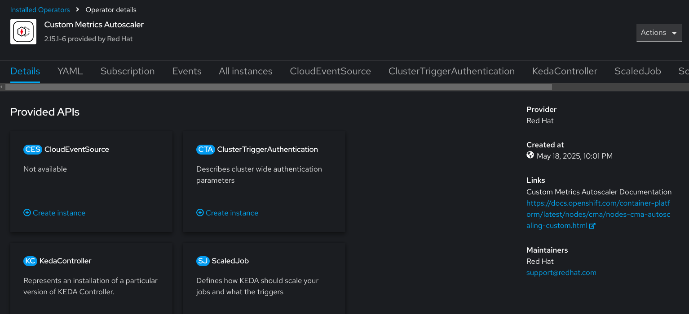

# Autoscaling of application based on metrics from Red Hat OpenShift Monitoring Prometheus instance (Thanos)
The following guide describes the way how can be application autoscaled by KEDA on Openshift. The application is being scaled based on the incoming HTTP requests collected by OpenShift Monitoring. If there isn't any traffic the application is autoscaled to 1 replicas, if there's some load the number of replicas is being scaled up to 10 replicas. 

Autoscaling to 0 replicas can't work for this type of application, because metrics (incoming requests) are collected directly from the application instance. So if there isn't application deployed, KEDA doesn't have any way how to collect metrics.

Prometheus KEDA scaler is being used for this setup, for details please refer to [documentation](https://keda.sh/docs/latest/scalers/prometheus/).

### Architecture:


### Video recording of this demo:
[](https://youtu.be/3T3VWCeyRgI)

---

## 0. Install KEDA and enable OpenShift monitoring for user-defined projects
 1. In `OperatorHub` locate and install Custom Metrics Autoscaler

 1. In Custom Metrics Autoscaler install KedaController in openshift-keda project with keda name

 1. Verify keda pods

 1. Be sure to enable OpenShift monitoring for user-defined projects. Please refer to the [documentation](https://docs.redhat.com/en/documentation/openshift_container_platform/4.16/html/monitoring/configuring-user-workload-monitoring#enabling-monitoring-for-user-defined-projects-uwm_preparing-to-configure-the-monitoring-stack-uwm), or you can create following ConfigMap to do so:
    ```bash
    oc apply -f configmap.yaml
    ```

 1. Be sure enableUserWorkload: true


## 1. Deploy application that exposes Prometheus metrics
Following command deploys application together with `Service` and `ServiceMonitor`:
```bash
oc apply -f deployment.yaml
```
Verify the application is correctly deployed:
```bash
oc logs deployment.apps/test-app  
```
You should see similar output:
```
2022/02/09 16:31:59 Server started on port 8080
```

## 2. Create a Service Account or reuse existing one, locate assigned token
1. You need a Service Account to authenticate with Thanos instance, you can reuse existing one or create a new one:
```bash
oc create serviceaccount thanos 
```
2. Locate the token assigned to the Service Account (replace `thanos` in the following command if you use existing Service Account)
```bash
oc describe serviceaccount thanos 
```
You should see following output:
```bash
Name:                thanos
Namespace:           default
Labels:              <none>
Annotations:         <none>
Image pull secrets:  thanos-dockercfg-wr7fb
Mountable secrets:   thanos-token-qkg4p
                     thanos-dockercfg-wr7fb
Tokens:              thanos-token-qkg4p
                     thanos-token-xf7l9
Events:              <none>
```
In this case we will use token `thanos-token-qkg4p`.

3. If your toke is empty create new one
```bash
oc create -f thanos-token.yaml
```

## 3. Define TriggerAuthentication with the Service Account's token
Replace `<SA_TOKEN>` with the token (in our example with `thanos-token-qkg4p`) in [triggerauthentication.yaml](triggerauthentication.yaml) file. Then create `TriggerAuthentication` resource in the cluster:
```bash
oc apply -f triggerauthentication.yaml
```

## 4. Create a role for reading metric from Thanos
To allow the Service Account to read metrics from Thanos, we need to create folllowing role (`thanos-metrics-reader`):
```bash
oc apply -f role.yaml
```

## 5. Add the role for reading metrics from Thanos to the Service Account
 1. Run the following command, replace `<SERVICE_ACCOUNT>` with the used Service Account (in our example with `thanos`) and `<NAMESPACE>` with the namespace where is deployed our application.
```bash
oc adm policy add-role-to-user thanos-metrics-reader -z <SERVICE_ACCOUNT> --role-namespace=<NAMESPACE>
```
 2. Alternatively you can apply [rolebinding.yaml](rolebinding.yaml) file, where you need to replace `<SERVICE_ACCOUNT>` and `<NAMESPACE>` properties with the correct values.
```bash
oc apply -f rolebinding.yaml
```

## 6. Deploy ScaledObject to enable application autoscaling
Replace `<NAMESPACE>` property in [scaledobject.yaml](scaledobject.yaml) file with the namespace where is deployed our application. And deploy this resource:
```bash
oc apply -f scaledobject.yaml
```
Check that KEDA has been able to access metrics and is correctly defined for autoscaling:
```bash
oc get scaledobject prometheus-scaledobject 
```
You should see similar output, `READY` should be `True`:
```bash
NAME                      SCALETARGETKIND      SCALETARGETNAME   MIN   MAX   TRIGGERS     AUTHENTICATION                 READY   ACTIVE   FALLBACK   AGE
prometheus-scaledobject   apps/v1.Deployment   test-app          1     10    prometheus   keda-trigger-auth-prometheus   True    False    False      1m41s
```

## 7. Generate requests to test the application autoscaling
Replace `<NAMESPACE>` in URL in [load.yaml](load.yaml) file. Then create this Kubernetes Job with the following command:
```bash
oc create -f load.yaml
```
You should see created an increased nubmer replicas of the test Consumer application until all sent requests are processed. And the the application will be again autoscaled down to one replica. You can check the changing number of replicas by running the following command:
```bash
watch oc get deployment.apps/test-app
```

The output should be similar:
```bash
Every 2,0s: oc get deployment.apps/test-app

NAME       READY   UP-TO-DATE   AVAILABLE   AGE
test-app   10/10   10           10          3m17s

### After some time the application should be autoscaled back to 1

Every 2,0s: oc get deployment.apps/test-app
NAME       READY   UP-TO-DATE   AVAILABLE   AGE
test-app   1/1     1            1           10m
```

## 8. Clean up
Run the following commands to remove all resources created in the namespace
```bash
oc delete jobs --field-selector status.successful=1 
oc delete -f triggerauthentication.yaml
oc delete -f scaledobject.yaml
oc delete -f deployment.yaml
oc delete -f secret.yaml
oc delete -f rolebinding.yaml
oc delete -f role.yaml

### To disable OpenShift monitoring for user-defined projects run:
oc delete -f configmap.yaml
``` 
